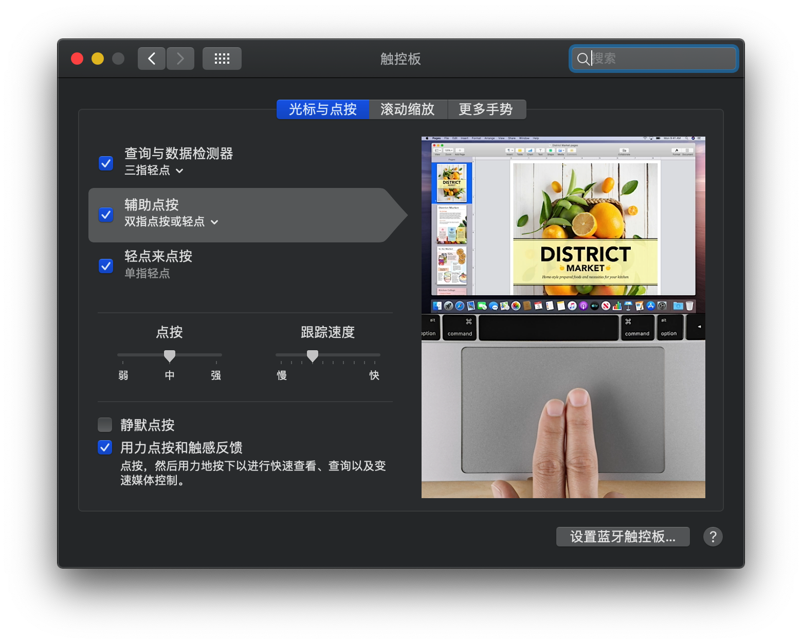

# XiaoXinPro-13-hackintosh

## Lenovo XiaoXin Pro 13 2019&2020 Hackintosh
### 适用：`2019 & 2020款小新pro13(s) Intel版本`
## 电脑配置
|规格 | 详细信息|
|:-: | :-:|
|电脑型号|联想小新pro13 笔记本电脑|
|操作系统|macOS Catalina 10.15.x / ~~macOS Mojave 目前触摸板驱动不支持14.x~~|
|处理器|英特尔 酷睿 i5 - 10210U / i7-10710U|
|内存|16GB板载无法更换|
|硬盘| 混搭,以下有说明 |
|显卡|Intel HD Graphics CFL CRB|（UHD620）|
|显示器|13.3 英寸 IPS 2560x1600|
|声卡| Realtek ALC257|
|网卡| [原装网卡AX201](https://github.com/daliansky/XiaoXinPro-13-hackintosh/wiki/%E5%B0%8F%E6%96%B0pro13%E5%9C%A8macOS%E7%B3%BB%E7%BB%9F%E4%B8%8B%E5%8F%AF%E4%BD%BF%E7%94%A8%E7%9A%84%E7%BD%91%E5%8D%A1) 或其他网卡如 [DW1820A](https://blog.daliansky.net/DW1820A_BCM94350ZAE-driver-inserts-the-correct-posture.html)|

## 已知问题
- CPU为`i7-10710U`的需要仿冒cpuid ：`0x0806EC`、`0x0806EB` 或其他），才能正常安装并驱动集显, [已仿冒CPUID的EFI](https://github.com/daliansky/XiaoXinPro-13-2019-hackintosh/releases);
- 目前 `声卡MIC`、~~`睡眠`~~ 这些比较棘手的问题需要解决，正常使用已经没有问题。

## 安装部分

混搭硬盘: （`黑苹果下：可用、不可用`）
- `可用`：UMIS开头的是忆联（忆联AH530）
- `可用`：INTEL开头的是因特尔（INTEL 760P)
- `可用`：WD BLACK开头的是西数（SN 730)
- `不可用`：SKHynix开头的是海力士（Hynix PC601 ?：`SK HYNIX SKHynix_HFS512GD9TNI-L2A0B`)
- `不可用`：SAMSUNG开头的是三星（三星PM981a：`SAMSUNG MZVLB512HBJQ-000L2`)  

`PS`: 以上是已知道型号，倘若还有其他型号：既不代表可用，也代表不可用！

如果你的机子硬盘是三星固态硬盘(`SAMSUNG MZVLB512HBJQ-000L2`) 或 海力士(`SKHynix_HFS512GD9TNI-L2A0B`)，  
为了更好使用 `macOS` ，强烈建议替换其他型号 

详细的安装教程请移步：[联想小新PRO 13 2019兼macOS Catalina安装教程](https://blog.daliansky.net/Lenovo-Xiaoxin-PRO-13-2019-and-macOS-Catalina-Installation-Tutorial.html) 

- ### 安装教程

    - `Fn+F2`进入`BIOS`,
    - 先查看 `Information`：`Secure Boot` 是否为 `Disabled`;
    - 如果 `Secure Boot` 是 `Enabled`，选择左边到 `Security`： 设置 `Secure Boot` 为 `Disabled`;
    - `Fn+F10` 保存设置

- ### 安装后操作

    - 安装好系统，先用 `安装的EFI` 进入系统
    - 然后找到`终端`执行一下：
    - `sudo spctl --master-disable`
    - 再执行`重建缓存`: 
    - `sudo kextcache -i /`
    - 替换 `EFI` 或 `config.plist`
    - 重启

- ### OC 与 Clover之间切换：
   - 例如Clover 转 OC
   - 先设置OC启动
   - 第一次重启，选择`reset nvram`，这时之前的启动设置会清除了
   - 再次设置对应的`EFI`启动即可

     
   
## 镜像下载
  
  - [[**黑果小兵的部落阁**] :【黑果小兵】原版镜像](https://blog.daliansky.net/categories/下载/镜像/)

## 问题解答(FAQ)
  - ### [Wiki](https://github.com/daliansky/XiaoXinPro-13-hackintosh/wiki)

## EFI 下载
  - ### [Releases](https://github.com/daliansky/XiaoXinPro-13-2019-hackintosh/releases)

## 更新日志  
  - ### [Changelog](Changelog.md)

## 注意

- 安装注意：小新由于安装过程中触摸板可能无法驱动，使用U盘安装macOS会占用仅仅一个USB接口,
  建议安装之前先买个usb拓展,用于插入鼠标,来进行安装步骤选项设定
- 该EFI目录中有CLOVER引导方式，也有OC的引导方式，
  目前两种方法都可以使用，但是OC引导方式，需要自己添加win系统的引导，
  具体方法：[添加引导](EFI/Document/OC-引导多系统@OC-xlivans.md)
## 正常工作
- 显卡

- 电源

- 蓝牙

- 显示器亮度调节

- 无线（[原网卡AX201](https://github.com/daliansky/XiaoXinPro-13-hackintosh/wiki/%E5%B0%8F%E6%96%B0pro13%E5%9C%A8macOS%E7%B3%BB%E7%BB%9F%E4%B8%8B%E5%8F%AF%E4%BD%BF%E7%94%A8%E7%9A%84%E7%BD%91%E5%8D%A1) 在macOS 下可以驱动了(`08-02-2020`)，当然[DW1820A ](https://blog.daliansky.net/DW1820A_BCM94350ZAE-driver-inserts-the-correct-posture.html)使用体验上也不错)

- 触摸板 (`02-17-2020`) （1、`OC`关闭触摸板方法：`FN+F6`2、`目前触摸板驱动不支持14.x` ）

  

- USB定制（采用 `ACPI` 方式，为使用 `OC` 做准备）

- 声卡 [声卡 ID 使用说明](Changelog.md#oc--clover-%E5%85%B3%E4%BA%8E%E5%A3%B0%E5%8D%A1id-%E4%BD%BF%E7%94%A8%E6%83%85%E5%86%B5)

- 其它 `ACPI` 补丁修复采用 `hotpatch` 方式，文件位于 `/CLOVER/ACPI/patched`

## 不正常工作
- ~~睡眠~~ (小新PRO13不能真正睡眠，可以仿真睡眠。唤醒比较困难，`OC` 下唤醒方法是：`电源键`唤醒)
- 声卡MIC(`暂时解决方法`：启动台-声音-输入：手动切换到“`外接可用麦克风设备`”)

关于 小新PRO13(2019/2020/13S Intel版本) 没有S3睡眠延展

D0 就是正常工作状态，S0 是 D0 的电源管理，S0睡眠应该是不存在的，说 S0 睡眠，本质就是 D0 状态下进入了空闲，所以有了空闲状态下的电源管理，这个机器没有 S3睡眠，没有设计相关硬件

但因 ACPI 有了 S3才导致苹果试图进入睡眠，但因缺少必须的硬件最终失败，对于 Windows 不妨碍
更详细的说明移步<a href="https://github.com/daliansky/OC-little" target="_blank">OC-little</a>

## 哪些可以工作更好
- 开启 [HIDPI](https://github.com/xzhih/one-key-hidpi) 来提升系统UI质量, `可能会出现花(黑)屏现象`

## QQ群
- 小新pro黑苹果    946132482  未满
- 小新pro黑苹果技术群 673294583 未满
- 小新pro13 黑苹果 insyde bios研究群 635160015  未满
### 为了更好地理解你遇到的问题，强烈建议：
- 先看 **[wiki](https://github.com/daliansky/XiaoXinPro-13-hackintosh/wiki)**   
- 不行就自行排错：例如：`重建缓存`，`重启`
- 贴`小新pro13的硬件信息`(如鲁大师截图)
- 提供 `详细描述操作过程`
- 提供 `日志` 或 `完整截图`
